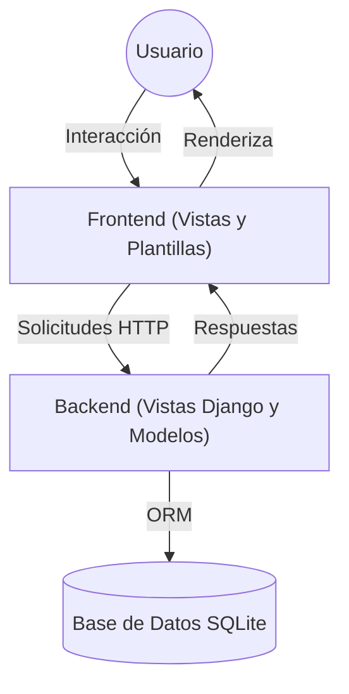

# Arquitectura Global del Sistema Biblioteca

## Tabla de Contenidos
1. Visión General
2. Diagrama de Componentes
3. Flujos Clave
4. Referencias Cruzadas

---

## 1. Visión General

El sistema "Biblioteca 210" está construido sobre Django, un framework robusto para aplicaciones web en Python. La arquitectura sigue el patrón MVC (Modelo-Vista-Controlador), donde:
- **Modelos**: Definen la estructura de los datos y las reglas de negocio (carpeta `libros/models.py`).
- **Vistas**: Gestionan la lógica de presentación y el flujo de datos entre el usuario y el sistema (carpeta `views`).
- **Plantillas**: Renderizan la interfaz de usuario (carpetas `templates`).
- **Base de datos**: `db.sqlite3` almacena toda la información persistente.

La separación de responsabilidades permite un desarrollo más limpio, mantenible y escalable.

---

## 2. Diagrama de Componentes

*Figura 1: Arquitectura global mostrando interacciones entre componentes*

---

## 3. Flujos Clave

### a) Alta de Material
1. El usuario accede al formulario de alta en el frontend.
2. El frontend envía los datos mediante POST al backend.
3. El backend valida y guarda la información en la base de datos usando los modelos.
4. El sistema responde con confirmación o mensaje de error.

### b) Consulta y Listado
1. El usuario solicita ver materiales/libros/mapas.
2. El backend consulta la base de datos y envía los datos al frontend.
3. El frontend muestra la información de forma amigable.

### c) Modificación y Eliminación
1. El usuario selecciona un registro para modificar/eliminar.
2. El backend procesa la solicitud y actualiza la base de datos.

---

## 4. Referencias Cruzadas

- [Arquitectura Backend](./Arquitectura_Backend.md)
- [Arquitectura Frontend](./Arquitectura_Frontend.md)
- [Configuración](./Configuracion.md)
- [Convenciones](./Convenciones.md)
- [Tipos y Modelos](./Tipos.md)
- [Introducción](./Introduccion.md)
- [Documentación General](./Documentacion_General.md)

