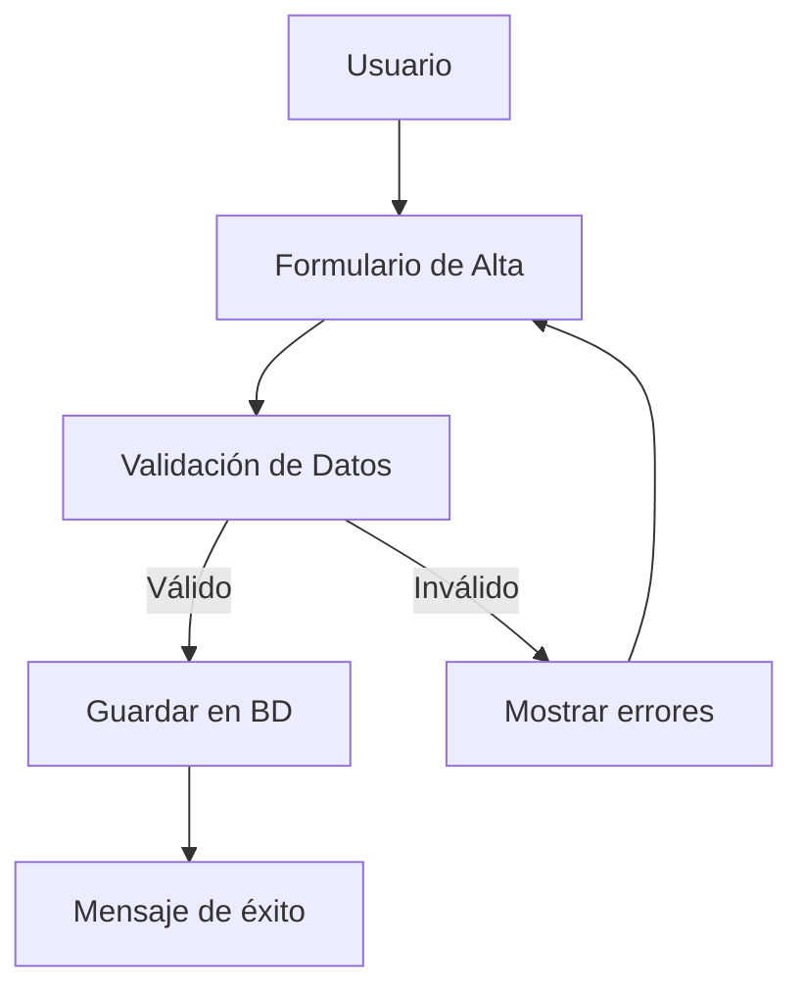

# Arquitectura del Backend Biblioteca

## Tabla de Contenidos
1. Visión General
2. Estructura de Carpetas y Archivos
3. Modelos y Relaciones
4. Formularios y Validaciones
5. Vistas y Flujos Principales
6. Ejemplos y Diagramas de Flujo

---

## 1. Visión General
El backend de Biblioteca 210 está construido sobre Django y sigue una arquitectura modular. El núcleo funcional reside en el módulo `libros`, encargado de la gestión de todos los recursos bibliográficos y tecnológicos. El módulo `views` centraliza la lógica de presentación y navegación general.

---

## 2. Estructura de Carpetas y Archivos

```plaintext
biblioteca_digital/
├── libros/
│   ├── models.py         # Modelos de datos (Libro, Mapas, Multimedia, Notebook, Proyector, Varios)
│   ├── forms.py          # Formularios basados en ModelForm
│   ├── views.py          # Lógica de negocio y vistas para cada recurso
│   ├── urls.py           # Rutas específicas del módulo
│   ├── admin.py          # Configuración del admin de Django
│   ├── tests.py          # Pruebas unitarias
│   ├── templates/        # Plantillas HTML específicas
│   └── static/           # Archivos estáticos del módulo
└── views/
    ├── templates/        # Plantillas generales y componentes visuales
    └── static/           # Recursos estáticos globales
```

---

## 3. Modelos y Relaciones

### Herencia y reutilización
Todos los recursos heredan de `Inventario`, lo que permite compartir campos comunes como estado, motivo de baja, descripción y número de ejemplar.

#### Ejemplo de Modelo:
```python
class Libro(Inventario):
    id_libro = models.AutoField(primary_key=True)
    titulo = models.CharField(max_length=255)
    autor = models.CharField(max_length=255)
    editorial = models.CharField(max_length=255)
    edicion = models.IntegerField(null=False, default=1999)
    codigo_materia = models.CharField(max_length=255, null=False, default=1)
    siglas_autor_titulo = models.CharField(max_length=255, null=False, default='ABC')
    num_inventario = models.IntegerField(null=False, default=1)
    resumen = models.TextField()
    img = models.URLField()
```

### Tabla de relaciones
| Modelo      | Hereda de   | Campos clave                         |
|-------------|-------------|--------------------------------------|
| Inventario  | models.Model| estado, motivo_baja, descripcion...  |
| Libro       | Inventario  | titulo, autor, editorial, ...        |
| Mapas       | Inventario  | tipo                                 |
| Multimedia  | Inventario  | materia, contenido                   |
| Notebook    | Inventario  | marca_not, modelo_not                |
| Proyector   | Inventario  | marca_pro, modelo_pro                |
| Varios      | Inventario  | tipo                                 |

---

## 4. Formularios y Validaciones
Se utilizan `ModelForm` para cada modelo, lo que permite validación automática y generación eficiente de formularios en las vistas.

#### Ejemplo:
```python
class LibroForm(forms.ModelForm):
    class Meta:
        model = Libro
        fields = [
            'titulo', 'autor', 'editorial', 'edicion', 'codigo_materia',
            'siglas_autor_titulo', 'num_inventario', 'resumen', 'img'
        ]
```

---

## 5. Vistas y Flujos Principales
Las vistas están organizadas por tipo de recurso y operación, siguiendo el patrón CRUD. Ejemplos:
- Alta, baja, modificación y edición de libros, mapas, multimedia, notebooks, proyectores y varios.
- Búsquedas especializadas por tipo de material.
- Importación masiva vía CSV.
- Gestión de préstamos y bajas.

#### Ejemplo de vista para alta de libro:
```python
def alta_libro(request):
    form = LibroForm(request.POST or None)
    if request.method == 'POST' and form.is_valid():
        libro = form.save(commit=False)
        libro.save()
        context = {'form': form, 'success': 'Libro registrado exitosamente.'}
    else:
        context = {'form': form, 'error': 'Por favor complete todos los campos obligatorios.'} if request.method == 'POST' else {'form': form}
    return render(request, 'libros/alta_libro.html', context)
```

---

## 6. Ejemplos y Diagramas de Flujo

### Diagrama de flujo: Alta de Libro


### Ejemplo de uso: Búsqueda de libros
```python
def buscar_libros(request):
    query = request.GET.get('q', '')
    libros = Libro.objects.filter(titulo__icontains=query)
    return render(request, 'libros/lista_libros.html', {'libros': libros})
```

---

**Nota:** Para más detalles sobre los modelos y flujos, ver también `Tipos.md` y `Convenciones.md`.


## Servicios Principales

El backend de Biblioteca 210 implementa los siguientes servicios fundamentales:
- **Gestión de Inventario:** Alta, modificación, consulta y eliminación de libros, materiales, mapas, multimedia, notebooks y proyectores.
- **Gestión de Préstamos:** Registro y control de préstamos y devoluciones de materiales.
- **Reportes y Consultas:** Generación de reportes y consultas avanzadas sobre el inventario y movimientos.

## Flujo de Autenticación Mejorado

La autenticación se basa en el sistema SIMEF:
1. El usuario accede a la página de login y envía sus credenciales.
2. SIMEF verifica usuario y contraseña contra la base de datos.
3. Si la autenticación es exitosa, se crea una sesión segura para el usuario.
4. En el apartado Bliblioteca de SIMEF se ingresa al sistema.

## Estructura de Directorios del Backend

```
├── biblioteca_digital/
│   ├── __init__.py
│   ├── settings.py         # Configuración general del proyecto
│   ├── urls.py             # Rutas principales del backend
│   ├── wsgi.py             # Interfaz de servidor WSGI
│   ├── libros/             # Módulo principal de inventario
│   │   ├── models.py       # Modelos de datos para libros
│   │   ├── views.py        # Vistas backend de libros
│   │   ├── admin.py       # Configuración del admin de Django
│   │   ├── migrations/     # Migraciones de base de datos
│   │   └── tests.py        # Pruebas unitarias
│   ├── materiales/
│   │   ├── models.py
│   │   ├── views.py
│   │   └── migrations/
│   ├── usuarios/
│   │   ├── models.py       # Modelos de usuarios
│   │   ├── views.py        # Vistas de gestión de usuarios
│   │   └── migrations/
│   └── utils/              # Utilidades y helpers
├── db.sqlite3              # Base de datos SQLite
├── manage.py             # Script de gestión de Django
└── requirements.txt       # Dependencias del proyecto
```

### Descripción de Directorios
- **`biblioteca_digital/`**: Directorio raíz del proyecto Django
- **`libros/`**: Módulo para gestión de libros
- **`materiales/`**: Módulo para gestión de otros materiales
- **`usuarios/`**: Módulo para gestión de usuarios
- **`utils/`**: Funciones y clases de utilidad

### Archivos Clave
- **`settings.py`**: Configuraciones globales del proyecto
- **`urls.py`**: Definición de rutas URL
- **`manage.py`**: Herramienta de administración de Django
- **`requirements.txt`**: Lista de dependencias del proyecto

## Dependencias Clave

- **Django:** Framework principal para el desarrollo web y ORM.
- **Pillow:** Manejo de imágenes.
- **SQLite3:** Base de datos ligera y fácil de administrar.
- **Herramientas estándar de Python:** Para utilidades y scripts auxiliares.

**Instalación recomendada:**
```bash
pip install django pillow
```

**Nota:** Se recomienda mantener las dependencias actualizadas y documentadas en un archivo `requirements.txt`.

