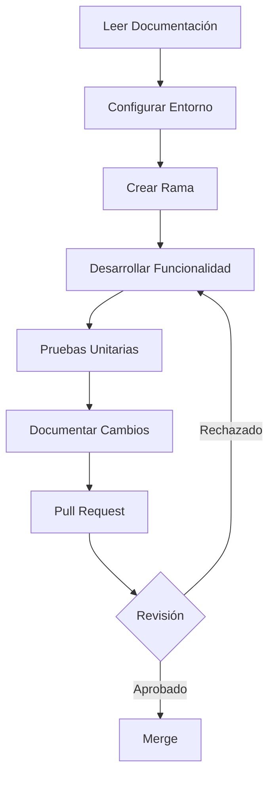

# Documentación Consolidada del Proyecto Biblioteca 210

## Estructura de Documentación

### 1. Introducción (`Introduccion.md`)
- Visión general del proyecto
- Objetivos y alcance
- Contexto institucional

### 2. Arquitectura (`Arquitectura.md`)
#### Componentes Principales
- Diagrama de arquitectura global
- Interacción entre servicios
- Flujos de datos principales

#### Backend (`Arquitectura_Backend.md`)
- Servicios principales
- Estructura de módulos
- Flujo de autenticación

#### Frontend (`Arquitectura_Frontend.md`)
- Componentes de interfaz
- Flujos de navegación
- Tecnologías utilizadas

### 3. Convenciones (`Convenciones.md`)
#### Desarrollo
- Nomenclatura de código
- Estructura de archivos
- Buenas prácticas

#### Control de Versiones
- Estructura de commits
- Proceso de pull requests
- Revisión de código

### 4. Configuración (`Configuracion.md`)
#### Entornos
- Requisitos previos
- Configuración de desarrollo y producción

#### Comandos Esenciales
- Instalación
- Ejecución de servicios
- Gestión de base de datos

### 5. Tipos de Datos (`Tipos.md`)
- Modelos de datos
- Estructuras principales
- Relaciones entre entidades

## Guía de Uso Rápido

| Cuando necesites... | Consulta... | Ejemplo de contenido |
|---------------------|-------------|----------------------|
| 🔍 Entender el sistema | `Arquitectura.md` | Diagramas de flujo de servicios |
| 🛠 Configurar entorno | `Configuracion.md` | Variables de entorno y dependencias |
| 📦 Implementar nuevos modelos | `Tipos.md` | Definiciones de modelos de datos |
| 💻 Resolver dudas de código | `Convenciones.md` | Estándares de desarrollo |
| 🌐 Comprender componentes | `Arquitectura_Backend.md` | Servicios y módulos |
| 🎨 Entender interfaz | `Arquitectura_Frontend.md` | Componentes y tecnologías |

### Consejos para Desarrolladores

#### Primeros Pasos
1. 📖 Leer documentación en orden
2. 🔧 Configurar entorno de desarrollo
3. 🧪 Familiarizarse con pruebas unitarias
4. 📝 Documentar cambios

#### Buenas Prácticas
- Seguir convenciones de código
- Mantener documentación actualizada
- Realizar revisiones de código
- Comunicar cambios de manera clara

### Flujo de Contribución

#### Niveles de Contribución
- 🟢 Principiante: Corrección de bugs
- 🟡 Intermedio: Nuevas funcionalidades
- 🔴 Avanzado: Arquitectura y diseño

## Recomendaciones Generales
- 🔍 Leer la documentación en orden
- 🛠 Seguir convenciones de código
- 📝 Documentar cambios y contribuciones
- 🤝 Colaborar de manera constructiva

## Contacto y Soporte
- **Repositorio:** [GitHub - biblioteca-210-insti](https://github.com/catriel458/biblioteca-210-insti)
- **Correo:** soporte.biblioteca@instituto210.edu.ar

**Última actualización:** Mayo 2025

> ℹ️ Todos los documentos usan español latinoamericano y siguen las convenciones de Markdown.